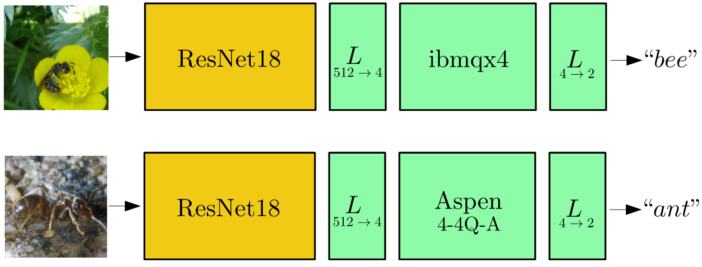

## High-resolution image classification with real quantum computers.
This folder contains the code that has been used in the paper [1] to experimentally classify high-resolution images of _ants_ and _bees_ with real quantum processors provided by IBM and Rigetti.

The model is a hybrid neural network composed of a classical block (ResNet18) and a variational "dressed quantum circuit" [1], which has been numerically optimized according to the classical-to-quantum (CQ) transfer learning paradigm. 

This code can be used to test the optimized model with two alternative quantum processing units (QPUs):
1. IBM Q 5, Tenerife (ibmq4x).
2. Rigetti Aspen-4-4Q-A.

## Contents
* `test_on_QPU.py`: Python script to test the hybrid classical-quantum image classifier with IBM or Rigetti quantum processors. 

* `quantum_weights.pt`: pre-trained model loaded by `test_on_QPU.py` to initialize the variational parameters of the hybrid network.

## Usage

To test the model with the IBM backend:
1. Make sure to satisfy all requirements (see next section).
2. Download or clone the repository.
3. Download the _Hymenoptera_ dataset as described in the main README file this repository.
4. Edit the local file `test_on_QPU.py` and set `backend = 'ibm'`.
4. Moreover, set your personal IBM token by editing `token = '<your token>'`.
5. Launch the script with the command `$ python3 test_on_QPU.py`.
6. The output files `results_ibm.txt` and  `predictions_ibm.png` will be generated.

To test the model with the Rigetti backend:
1. Make sure to satisfy all requirements (see next section).
2. Login to the Rigetti QCS and your quantum machine image (QMI).
3. Download or clone the repository in the QVM.
4. Download the _Hymenoptera_ dataset as described in the main README file of this repository. 
5. Edit the file `test_on_QPU.py` and set `backend = 'rigetti'`.
6.  Launch the script with the command `$ python3 test_on_QPU.py`.
7. The output files `results_rigetti.txt` and  `predictions_rigetti.png` will be generated.

## Requirements

Testing the model with the Rigetti backend requires having a Rigetti QCS account with access to a remote quantum virtual machine (QVM). In the QVM, the Python library PennyLane should be installed together with the associated PyTorch and Rigetti plugins. 

Testing the model with the IBM backend requires having an IBM Q Experience account and a local installation of the Qiskit SDK. The Python library PennyLane should be  installed together with the associated PyTorch and IBM plugins. 
